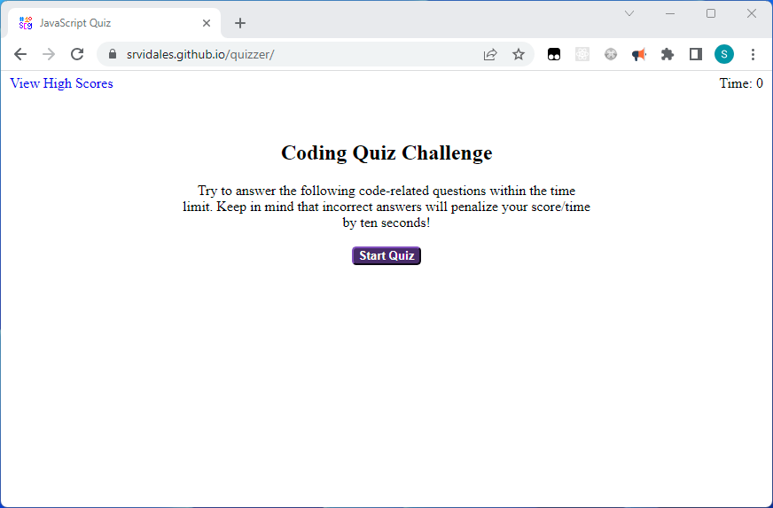

# Quizzer

You've heard of Weezer? Well this is Quizzer. Just a tad less famous.

This is the solution to the UC Berkeley Extensions coding boot camp module 4 challenge.
The challenge itself can be
found [here](https://courses.bootcampspot.com/courses/3826/assignments/57158?module_item_id=1005288)
and [here](https://git.bootcampcontent.com/University-of-California---Berkeley/UCB-VIRT-FSF-PT-06-2023-U-LOLC/-/tree/main/04-Web-APIs/02-Challenge).

## Table of Contents

- [About](#about)
- [Getting Started](#getting-started)
- [Installing](#installing)
- [Usage](#usage)
- [Docs](#docs)
- [Screenshot](#screenshot)
- [Contributing](#contributing)

## About

The purpose of this challenge is to familiarize the student with Web APIs by creating a Javascript Code Quiz App
from scratch.

## Getting Started

These instructions will get you a copy of the project up and running on your local machine for development and testing
purposes.

```bash
git clone git@github.com:srvidales/quizzer.git
```

## Installing

No installation required for the App to work, but you can install nodejs to make use of eslint. 

## Usage

Open the [page](https://srvidales.github.io/quizzer/) in your favorite browser and start the quiz by clicking
the start button. You will be asked a series of questions to test your Javascript knowledge. At the end, the quiz
will give you a score based on how long it took you to answer the questions. Notice that incorrect answers will cost
you 10 seconds. You may enter your initials to be saved for posterity for as long as you own your computer or be
tossed as soon as you click the Clear High Scores button.

## Docs

Code documentation can be generated by running jsdoc on assets/js/script.js.

## Screenshot



## Contributing

- Sergio Vidales Perez <srvidales@gmail.com>
